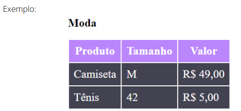
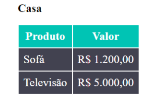

# Desafio Tabela - Tabela Estilizada
Esse foi um dos desafios propostos no curso <b>DevQuest</b> com os seguintes passos

- Faça uma tabela de roupas com tamanho e valor da peça descrito em cada linha.

- Não esqueça de adicionar um cabeçalho em cada coluna.

- Cor de fundo do cabeçalho moda - #BB86FC

- Cor de fundo do cabeçalho casa - #00C4B4

- Cor de fundo dos valores da tabela - #424250

*Regra: não estilize usando as tags HTML, crie classes para estilizar sua tabela.*

EX: .produtos-casa th { … }

 [

 ]

## 🧑‍💻 Tecnologias Utilizadas

- <b>HTML5</b>
- <b>CSS3</b>

## O que eu aprendi?
Aprendi a usar tags de HTML para uso e criação de tabelas com tags como:

1. <b>table</b>
2. <b>th - table header cell</b>
3. <b>tr - table row</b> 
4. <b>td - table data cell</b>

Também usei classes para estilização no CSS como:

 *"informações-roupas" "informações-produtos-casa"* para estilizar o cabeçalho de cada tabela.

  *"fundo-roupas" e "fundo-produtos"* para estilizar o fundo das tabelas, respectivamente.

## Qual a maior dificuldade?
Minha maior dificuldade foi apenas alinhar o texto no centro, não conseguindo logo de ínicio. A tabela eu consegui bem rápido, porém o título "Tabela Estilizada" e os "Subtítulos" "Moda" e "Casa" demoraram um pouco para que eu pudesse alinhá-los.